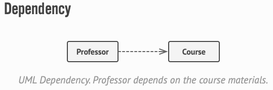
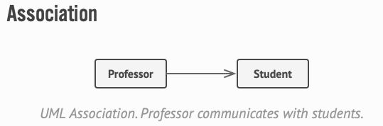
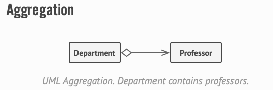
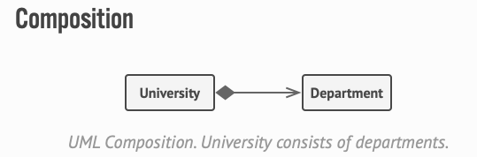

# Design Patterns and Programming Principles

## UML

## SOLID

### Single Responsibility Principle

A class should have just one reason to change.

### Open/Closed Principle

Classes should be open for extension but closed for modification.

### Liskov Sub­sti­tu­tion Prin­ci­ple

When extend­ing a class, remem­ber that you should be able to pass objects of the sub­class in place of objects of the par­ent class with­out break­ing the client code.

### Interface Segregation Principle

Clients shouldn’t be forced to depend on meth­ods they do not use.

### Dependency Inversion Principle

High-level class­es shouldn’t depend on low-level class­es. Both should depend on abstrac­tions. Abstrac­tions shouldn’t depend on details. Details should depend on abstractions.

## Design Patterns

### Creational

#### Factory Method

Factory Method is a creational design pattern that provides an interface for creating objects in a superclass, but allows subclasses to alter the type of objects that will be created.

#### Abstract Factory

Abstract Factory is a creational design pattern that lets you produce families of related objects without specifying their concrete classes.

#### Builder

Builder is a creational design pattern that lets you construct complex objects step by step. The pattern allows you to produce different types and representations of an object using the same construction code.

#### Prototype

Prototype is a creational design pattern that lets you copy existing objects without making your code dependent on their classes.

#### Singleton

Singleton is a creational design pattern that lets you ensure that a class has only one instance, while providing a global access point to this instance.

### Structural

#### Adapter

Adapter is a structural design pattern that allows objects with incompatible interfaces to collaborate.

#### Bridge

Bridge is a structural design pattern that lets you split a large class or a set of closely related classes into two separate hierarchies—abstraction and implementation—which can be developed independently of each other.

#### Composite

Composite is a structural design pattern that lets you compose objects into tree structures and then work with these structures as if they were individual objects.

Using the Composite pattern makes sense only when the core model of your app can be represented as a tree.

#### Decorator

Decorator is a structural design pattern that lets you attach new behaviors to objects by placing these objects inside special wrapper objects that contain the behaviors.

#### Facade

Facade is a structural design pattern that provides a simplified interface to a library, a framework, or any other complex set of classes.

#### Flyweight

Flyweight is a structural design pattern that lets you fit more objects into the available amount of RAM by sharing common parts of state between multiple objects instead of keeping all of the data in each object.

#### Proxy

Proxy is a structural design pattern that lets you provide a substitute or placeholder for another object. A proxy controls access to the original object, allowing you to perform something either before or after the request gets through to the original object.

### Behavioral

#### Chain of Responsibility

Chain of Responsibility is a behavioral design pattern that lets you pass requests along a chain of handlers. Upon receiving a request, each handler decides either to process the request or to pass it to the next handler in the chain.

#### Command

Command is a behavioral design pattern that turns a request into a stand-alone object that contains all information about the request. This transformation lets you parameterize methods with different requests, delay or queue a request’s execution, and support undoable operations.

#### Iterator

Iterator is a behavioral design pattern that lets you traverse elements of a collection without exposing its underlying representation (list, stack, tree, etc.).

#### Mediator

Mediator is a behavioral design pattern that lets you reduce chaotic dependencies between objects. The pattern restricts direct communications between the objects and forces them to collaborate only via a mediator object.

#### Memento

Memento is a behavioral design pattern that lets you save and restore the previous state of an object without revealing the details of its implementation.

#### Observer

Observer is a behavioral design pattern that lets you define a subscription mechanism to notify multiple objects about any events that happen to the object they’re observing.

#### State

State is a behavioral design pattern that lets an object alter its behavior when its internal state changes. It appears as if the object changed its class.

#### Strategy

Strategy is a behavioral design pattern that lets you define a family of algorithms, put each of them into a separate class, and make their objects interchangeable.

#### Template Method

Template Method is a behavioral design pattern that defines the skeleton of an algorithm in the superclass but lets subclasses override specific steps of the algorithm without changing its structure.

#### Visitor

Visitor is a behavioral design pattern that lets you separate algorithms from the objects on which they operate.