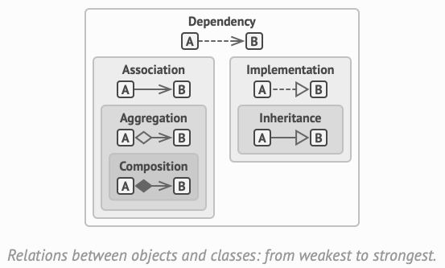

# Design Patterns and Programming Principles

## UML
---

## SOLID
---

### Single Responsibility Principle

A class should have just one reason to change.

### Open/Closed Principle

Classes should be open for extension but closed for modification.

### Liskov Sub­sti­tu­tion Prin­ci­ple

When extend­ing a class, remem­ber that you should be able to pass objects of the sub­class in place of objects of the par­ent class with­out break­ing the client code.

### Interface Segregation Principle

Clients shouldn’t be forced to depend on meth­ods they do not use.

### Dependency Inversion Principle

High-level class­es shouldn’t depend on low-level class­es. Both should depend on abstrac­tions. Abstrac­tions shouldn’t depend on details. Details should depend on abstractions.